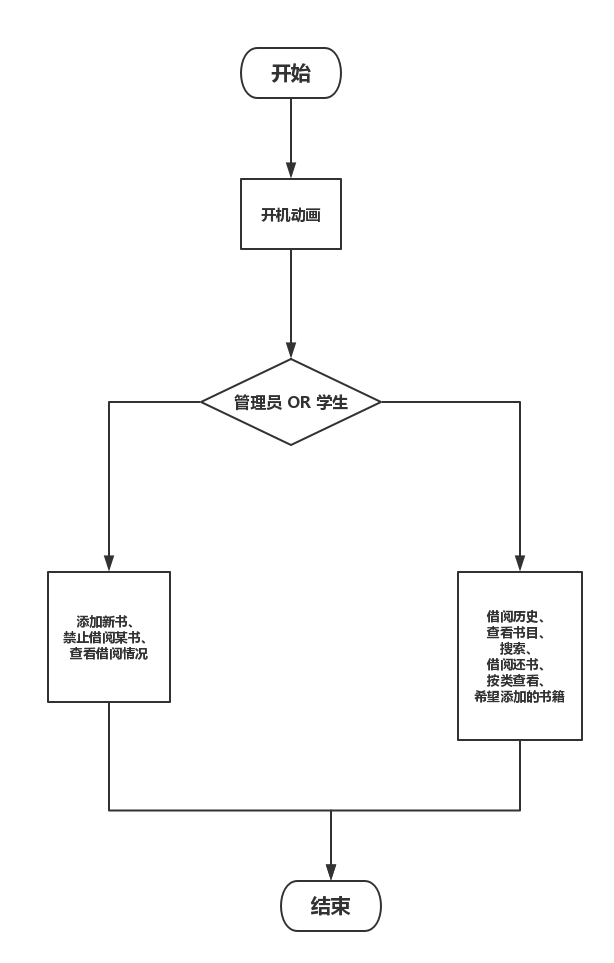

# 功能分析

## 功能一

分管理员和学生两种身份，不同身份操作不同
+   管理员
    +   进购书籍
    +   决定某本书是由被借阅
    +   查看借阅情况
+   学生
    +   借书，限制每人5本
    +   还书
    +   图书分类展示
    +   搜索

## 功能二

开机动画，功能就是提高逼格（可以考虑加上音效）。

## 储存

储存文件分为两个：书目（book_list），借阅历史（borrow_history）
+   书目只让管理员操作
+   借阅历史学生可以操作

